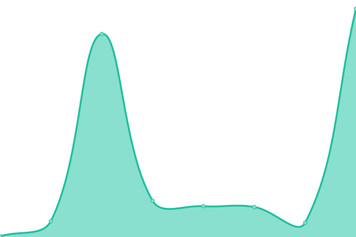
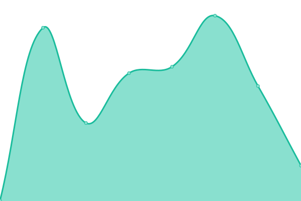

# [📈 Live Status](https://Domain-Connect.github.io/upptime): <!--live status--> **🟧 Partial outage**

This repository contains the open-source uptime monitor and status page for [Domain Connect](http://domainconnect.org), powered by [Upptime](https://github.com/upptime/upptime).

With [Upptime](https://upptime.js.org), you can get your own unlimited and free uptime monitor and status page, powered entirely by a GitHub repository. We use [Issues](https://github.com/Domain-Connect/upptime/issues) as incident reports, [Actions](https://github.com/Domain-Connect/upptime/actions) as uptime monitors, and [Pages](https://Domain-Connect.github.io/upptime) for the status page.

<!--start: status pages-->
<!-- This summary is generated by Upptime (https://github.com/upptime/upptime) -->
<!-- Do not edit this manually, your changes will be overwritten -->
<!-- prettier-ignore -->
| URL | Status | History | Response Time | Uptime |
| --- | ------ | ------- | ------------- | ------ |
|  [Domainconnect.org](https://domainconnect.org) | 🟩 Up | [domainconnect-org.yml](https://github.com/Domain-Connect/upptime/commits/HEAD/history/domainconnect-org.yml) | 

 868ms
     
 | 

<a href="https://Domain-Connect.github.io/upptime/history/domainconnect-org">100.00%</a>
    

|  [Domainconnect.org example service](https://exampleservice.domainconnect.org/) | 🟥 Down | [domainconnect-org-example-service.yml](https://github.com/Domain-Connect/upptime/commits/HEAD/history/domainconnect-org-example-service.yml) | 

 0ms
     
 | 

<a href="https://Domain-Connect.github.io/upptime/history/domainconnect-org-example-service">0.00%</a>
    

|  [Domainconnect.org DynDNS](https://dynamicdns.domainconnect.org/ddnscode?code=test&state=null) | 🟩 Up | [domainconnect-org-dyn-dns.yml](https://github.com/Domain-Connect/upptime/commits/HEAD/history/domainconnect-org-dyn-dns.yml) | 

 260ms
     
 | 

<a href="https://Domain-Connect.github.io/upptime/history/domainconnect-org-dyn-dns">100.00%</a>
    

<!--end: status pages-->

[**Visit our status website →**](https://Domain-Connect.github.io/upptime)

## 📄 License

- Powered by: [Upptime](https://github.com/upptime/upptime)
- Code: [MIT](./LICENSE) © [Domain Connect](http://domainconnect.org)
- Data in the `./history` directory: [Open Database License](https://opendatacommons.org/licenses/odbl/1-0/)
